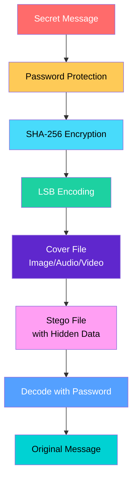

# 🔐 Steganography: The Art of Hidden Communication

<div align="center">


[](#)

<h3><i>Hide secrets in plain sight using advanced steganography techniques</i></h3>

</div>

---

## 📋 Table of Contents

- [🌟 Overview](#-overview)
- [🔍 How It Works](#-how-it-works)
- [🖼️ Types of Steganography](#️-types-of-steganography)
- [⚙️ Core Features](#️-core-features)
- [💻 Implementation](#-implementation)
- [🚀 Quick Start](#-quick-start)
- [🔐 Security Features](#-security-features)
- [📊 Advantages & Challenges](#-advantages--challenges)
- [🌍 Real-World Applications](#-real-world-applications)
- [🔮 Future Enhancements](#-future-enhancements)

---

## 🌟 Overview

### What is Steganography?

**Steganography** is the practice of concealing secret messages within ordinary, non-secret digital media. Unlike cryptography, which scrambles a message to make it unreadable, steganography hides the very **existence** of the message itself.

> *"Hidden in plain sight — where privacy meets innovation"*

### 🎯 Key Highlights

| Feature | Description |
|:-------:|:-----------|
| ✅ **LSB Encoding** | Least Significant Bit manipulation for invisible data embedding |
| ✅ **Multi-Format Support** | PNG, JPG, JPEG, MP3, and MP4 files |
| ✅ **Password Protection** | Secure, controlled access to hidden messages |
| ✅ **SHA-256 Verification** | Cryptographic integrity checking |
| ✅ **Backup System** | Secure hash storage for file verification |

---

## 🔍 How It Works

<div align="center">
  


</div>

### The Process Explained

<details>
<summary><b>📥 Encoding (Hiding Data)</b></summary>
<br>

1. **Select a cover file** (image, audio, or video)
2. **Enter your secret message**
3. **Set a strong password** for protection
4. **System applies LSB encoding** to hide the message
5. **SHA-256 hash** is generated for verification
6. **Download your encoded file** with hidden data

</details>

<details>
<summary><b>📤 Decoding (Extracting Data)</b></summary>
<br>

1. **Upload the encoded file**
2. **Enter the password** used during encoding
3. **Optional: Load backup file** for verification
4. **System extracts and decrypts** the hidden message
5. **View your original secret message**

</details>

---

## 🖼️ Types of Steganography

<div align="center">
  
| Type | Method | Use Case | Visual |
|:----:|:------:|:--------:|:------:|
| **Image** | Modify pixel LSB values | Hide text in photos | 🖼️ |
| **Audio** | Alter frequency components | Covert audio messages | 🎵 |
| **Video** | Embed in frames/audio | Secure video communication | 🎬 |

</div>

### 🖼️ Image Steganography

Image steganography hides secret data within an image **without altering its visible appearance**.

```
Original Pixel:   11011010  (Red value)
LSB Modification: 1101101[1] ← Secret bit inserted
Modified Pixel:   11011011  (Change invisible to human eye)
```

**Working**: The secret information is embedded by modifying the **least significant bits** of pixel values — changes so subtle they're imperceptible to the human eye.

### 🎵 Audio Steganography

Audio steganography conceals information within an audio file **without affecting perceptible quality**.

**Working**: Hidden data is embedded by subtly modifying audio signals in a way that remains **undetectable to the human ear** — using techniques like phase coding, spread spectrum, or echo hiding.

### 🎬 Video Steganography

Video steganography hides secret data within video files by subtly modifying frames, pixels, or audio signals.

**Working**: Data is embedded within **frames**, **motion vectors**, or **audio signals** across the video timeline, making detection extremely difficult due to the large data capacity.

---

## ⚙️ Core Features

<div align="center">
  <table>
    <tr>
      <th colspan="2">✨ Feature Highlights</th>
    </tr>
    <tr>
      <td width="50%">
        <h3>🔐 Dual Protection</h3>
        <p>Combines password protection with SHA-256 hashing for double security. Even if the stego file is discovered, attackers cannot access the hidden message without the password.</p>
      </td>
      <td width="50%">
        <h3>📁 Multi-Format Support</h3>
        <div align="center">
          <span class="format-badge">PNG</span> • <span class="format-badge">JPG</span> • <span class="format-badge">JPEG</span> • <span class="format-badge">MP3</span> • <span class="format-badge">MP4</span>
        </div>
        <p>Hide data in images, audio files, and videos — maximum flexibility for any use case.</p>
      </td>
    </tr>
    <tr>
      <td>
        <h3>✅ Integrity Verification</h3>
        <p>SHA-256 hash verification ensures files haven't been tampered with. The backup system stores secure hashes for authenticity checking.</p>
      </td>
      <td>
        <h3>📊 Real-Time Progress</h3>
        <p>Visual progress bars show encoding/decoding status. Clear feedback at every step of the process.</p>
      </td>
    </tr>
    <tr>
      <td>
        <h3>🔒 Password Strength Checker</h3>
        <p>Built-in password strength meter ensures you create secure passwords with real-time feedback on requirements.</p>
      </td>
      <td>
        <h3>📋 Backup System</h3>
        <p>Automatic backup file generation stores cryptographic hashes for future verification and integrity checking.</p>
      </td>
    </tr>
  </table>
</div>

---

## 💻 Implementation

### 🧩 Core Data Structures

```javascript
// Secret Message Metadata Structure
const metadata = {
    message: "Your secret message here",
    timestamp: "2024-01-15T10:30:00.000Z",
    passwordHash: "5e884898da28047151d0e56f8dc6292773603d0d6aabbdd62a11ef721d1542d8",
    fileType: "image/png"
};
```

### 🔐 Password-Based Key Derivation (PBKDF2)

```javascript
async function deriveKey(password, salt) {
    const enc = new TextEncoder();
    const keyMaterial = await crypto.subtle.importKey(
        'raw',
        enc.encode(password),
        'PBKDF2',
        false,
        ['deriveBits']
    );
    
    const derivedBits = await crypto.subtle.deriveBits(
        {
            name: 'PBKDF2',
            salt: enc.encode(salt),
            iterations: 100000,
            hash: 'SHA-256'
        },
        keyMaterial,
        256
    );
    
    return Array.from(new Uint8Array(derivedBits))
        .map(b => b.toString(16).padStart(2, '0'))
        .join('');
}
```

### 🔒 LSB Encoding Simulation

```javascript
// Simplified LSB encoding concept
function encodeLSB(pixelValue, secretBit) {
    // Clear the LSB (set to 0)
    pixelValue = pixelValue & 0xFE;
    // Insert the secret bit
    return pixelValue | secretBit;
}

// Original:  11011010 (218)
// Secret:    1
// Modified:  11011011 (219) ← Difference invisible to human eye
```

### ✅ SHA-256 Hashing

```javascript
async function sha256(message) {
    const msgBuffer = new TextEncoder().encode(message);
    const hashBuffer = await crypto.subtle.digest('SHA-256', msgBuffer);
    const hashArray = Array.from(new Uint8Array(hashBuffer));
    return hashArray.map(b => b.toString(16).padStart(2, '0')).join('');
}
```

---

## 🚀 Quick Start

### Option 1: Web Interface (HTML/JavaScript)

```bash
# Clone the repository
git clone https://github.com/W01-vian/Steganography-System.git

# Navigate to project directory
cd Steganography-System

# Open the HTML file in your browser
open steganography_system.html
# or simply double-click the file
```

### 📱 Usage Guide

<div align="center">
  
| Step | Action | Description |
|:----:|:------:|:-----------|
| **1** | **Choose Mode** | Select Encode (hide) or Decode (extract) |
| **2** | **Upload File** | Select PNG, JPG, MP3, or MP4 cover file |
| **3** | **Enter Message** | Type your secret message to hide |
| **4** | **Set Password** | Create a strong password for protection |
| **5** | **Encode/Decode** | Process your file with one click |
| **6** | **Download** | Save your encoded file or view hidden message |

</div>

### 🎯 Quick Example

```javascript
// Encode a secret message
1. Upload: "family_photo.jpg"
2. Message: "Meeting at 5pm in the park"
3. Password: "SecurePass123!"
4. Click: "Encode & Download"
5. Result: "encoded_family_photo.jpg" (looks identical!)
```

---

## 🔐 Security Features

<div align="center">
  
| Security Layer | Technology | Purpose |
|:--------------:|:----------:|:-------:|
| **Encryption** | PBKDF2 + SHA-256 | Password-based key derivation |
| **Hashing** | SHA-256 | Integrity verification |
| **Authentication** | Password Hash Comparison | Controlled access |
| **Backup** | Cryptographic Hash Storage | File verification |

</div>

### 🔒 Password Strength Requirements

<div align="center">
  
| Level | Criteria | Visual |
|:-----:|:--------:|:------:|
| **Weak** | < 6 characters | 🔴 |
| **Medium** | 8+ chars + letters + numbers | 🟡 |
| **Strong** | 12+ chars + uppercase + lowercase + numbers + special | 🟢 |

</div>

### ✅ Password Requirements Checklist

- [ ] At least 8 characters
- [ ] Contains uppercase letter
- [ ] Contains lowercase letter
- [ ] Contains numbers
- [ ] Contains special characters (!@#$%^&*)

---

## 📊 Advantages & Challenges

### 🟢 Key Advantages

<div align="center">
  
| Advantage | Description |
|:---------:|:-----------|
| **🕵️ Concealment** | Hides the very existence of the message, not just its content |
| **🔗 Integration** | Combines seamlessly with existing media without visible changes |
| **📦 Capacity** | Can hide significant amounts of data in video files |
| **🔐 Dual Protection** | Even if detected, password protection secures the message |
| **✅ Integrity** | SHA-256 ensures files haven't been tampered with |

</div>

### 🔴 Challenges Overcome

<div align="center">
  
| Challenge | Solution |
|:---------:|:--------|
| **Data Loss Prevention** | Careful embedding to preserve original file integrity |
| **Limited Capacity** | Optimized encoding for maximum data hiding |
| **Detection Risk** | Advanced LSB techniques to avoid statistical anomalies |
| **Performance** | Efficient JavaScript implementation for fast processing |
| **Complexity** | User-friendly interface abstracts technical complexity |

</div>

---

## 🌍 Real-World Applications

<div align="center">
  <table>
    <tr>
      <td align="center">
        <br/>
        <b>Journalism</b>
      </td>
      <td align="center">
        <br/>
        <b>Healthcare</b>
      </td>
      <td align="center">
        <br/>
        <b>Legal</b>
      </td>
      <td align="center">
        <br/>
        <b>Defense</b>
      </td>
    </tr>
    <tr>
      <td>Protect sources in censored regions</td>
      <td>Securely share patient data</td>
      <td>Protect sensitive legal documents</td>
      <td>Covert military communications</td>
    </tr>
    <tr>
      <td align="center">
        <br/>
        <b>Copyright</b>
      </td>
      <td align="center">
        <br/>
        <b>Forensics</b>
      </td>
      <td align="center">
        <br/>
        <b>Finance</b>
      </td>
      <td align="center">
        <br/>
        <b>Cloud Storage</b>
      </td>
    </tr>
    <tr>
      <td>Digital watermarking</td>
      <td>Hidden evidence protection</td>
      <td>Secure transaction data</td>
      <td>Stealth data storage</td>
    </tr>
  </table>
</div>

---

## 🔮 Future Enhancements

### 📅 Short-term Improvements

- [ ] **Drag & Drop Interface** - Enhanced file upload experience
- [ ] **Batch Processing** - Encode multiple files simultaneously
- [ ] **More File Formats** - Add GIF, BMP, WAV, AVI support
- [ ] **Cloud Integration** - Direct upload to Google Drive/Dropbox

### 🚀 Long-term Features

- [ ] **AI-Based Steganalysis Resistance** - Machine learning to avoid detection
- [ ] **Mobile Application** - Native iOS and Android apps
- [ ] **End-to-End Encryption** - Full message encryption before embedding
- [ ] **Real-Time Communication** - Live steganographic messaging

### 🤖 Advanced Research Areas

- [ ] **Quantum Steganography** - Leveraging quantum properties for unhackable hiding
- [ ] **Deep Learning Generation** - AI-optimized cover media creation
- [ ] **Blockchain Integration** - Immutable verification of hidden data

---

### 🫱🏻‍🫲🏼 Collaborative Work

| Activity | Approach |
|:--------:|:--------|
| **Code Reviews** | Weekly peer reviews and pair programming |
| **Testing** | Comprehensive test cases for all features |
| **Documentation** | Shared responsibility with clear ownership |
| **Debugging** | Collaborative problem-solving sessions |

---

<div align="center">
  
  ## 🌟 Thank You for Exploring Our Project! 🌟
  
  
  
  <p><i>“The best place to hide a secret is in plain sight.”</i></p>
  
  [🔝 Back to Top](#-steganography-the-art-of-hidden-communication)
  
  ---
  
  <sub>Associated with National University of Technology (NUTECH)</sub>
  
</div>
